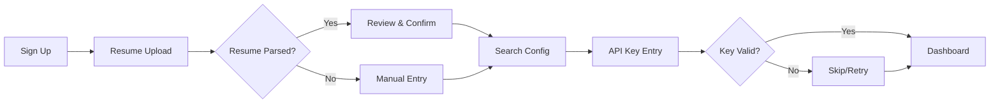
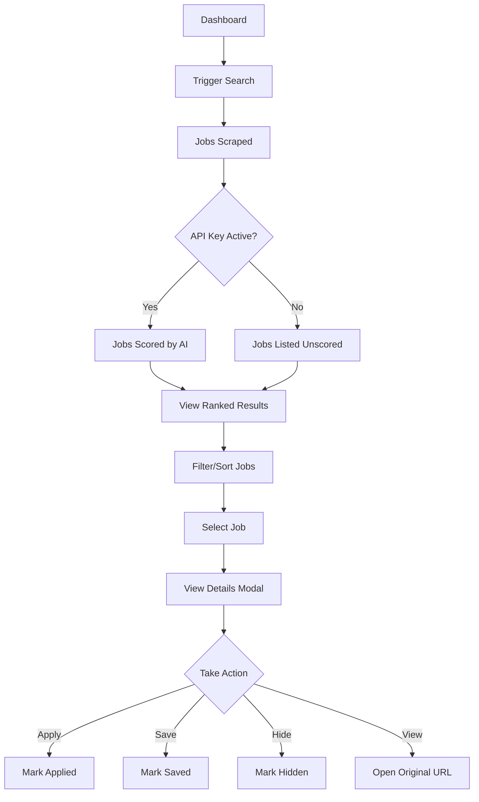
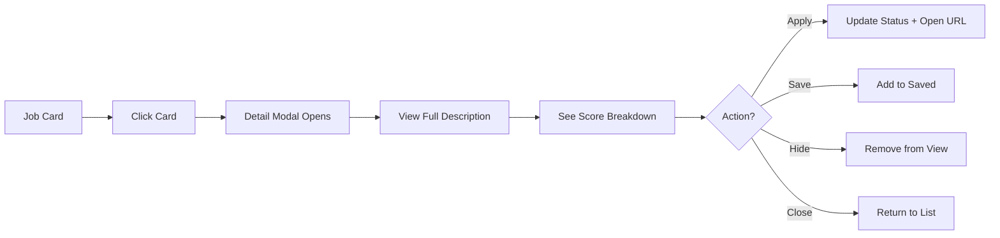

# UX Design Document - Job Scout

**Author:** BMAD UX Workflow  
**Date:** 2026-01-05  
**Version:** 1.0

---

## 1. Design Philosophy

### 1.1 Core Principles

| Principle                  | Description                                       |
| -------------------------- | ------------------------------------------------- |
| **Transparency**           | Show users exactly how and why jobs are scored    |
| **Progressive Disclosure** | Simple at first, details on demand                |
| **Focus**                  | Highlight the best matches, minimize distractions |
| **Efficiency**             | Minimize clicks to find and act on opportunities  |

### 1.2 Target Experience

Users should feel like they have a **personal recruiting assistant** that:

- Understands their qualifications
- Finds relevant opportunities automatically
- Explains why each job is a good/bad fit
- Tracks their job search progress

---

## 2. Information Architecture

### 2.1 Site Map

```
Job Scout
├── Landing Page (/)
├── Sign In (/sign-in)
├── Sign Up (/sign-up)
├── Onboarding Flow (/onboarding)
│   ├── Step 1: Resume Upload (/onboarding/resume)
│   ├── Step 2: Search Config (/onboarding/config)
│   └── Step 3: API Key (/onboarding/api-key)
├── Dashboard (/) [Authenticated]
│   ├── Jobs Tab (default)
│   ├── Metrics Tab (/metrics)
│   └── Settings Tab (/settings)
└── Job Detail (Modal)
```

### 2.2 Navigation Structure

```
┌──────────────────────────────────────────────────────────────────┐
│  [Logo] Job Scout            [Profile Selector] [User Menu]     │
├──────────────────────────────────────────────────────────────────┤
│  [Jobs] [Metrics] [Settings]                                     │
├──────────────────────────────────────────────────────────────────┤
│                                                                  │
│                      Main Content Area                           │
│                                                                  │
└──────────────────────────────────────────────────────────────────┘
```

---

## 3. User Flows

### 3.1 Onboarding Flow



**Key Decisions:**

- Resume is required (defines user's profile)
- API key is optional (can skip and enter later)
- 3-step progress indicator always visible

### 3.2 Job Discovery Flow



### 3.3 Job Interaction Flow



---

## 4. Component Inventory

### 4.1 UI Primitives (Radix-based)

| Component | File            | Purpose                                                       |
| --------- | --------------- | ------------------------------------------------------------- |
| Button    | `ui/button.tsx` | Primary actions, variants: default, outline, ghost, secondary |
| Card      | `ui/card.tsx`   | Container for job listings                                    |
| Badge     | `ui/badge.tsx`  | Tier indicators (A/B/C/D)                                     |
| Dialog    | `ui/dialog.tsx` | Job detail modal                                              |
| Input     | `ui/input.tsx`  | Text entry fields                                             |
| Label     | `ui/label.tsx`  | Form field labels                                             |

### 4.2 Feature Components

| Component       | File                          | Purpose                                       |
| --------------- | ----------------------------- | --------------------------------------------- |
| JobCard         | `jobs/JobCard.tsx`            | Job listing display with score, tier, actions |
| ProfileSelector | `ProfileSelector.tsx`         | Switch between user profiles                  |
| FilterBar       | `dashboard/FilterBar.tsx`     | Filter jobs by tier/source/status             |
| StatsOverview   | `dashboard/StatsOverview.tsx` | Dashboard metrics cards                       |

### 4.3 Page Layouts

| Layout            | Route                    | Purpose                              |
| ----------------- | ------------------------ | ------------------------------------ |
| Dashboard Layout  | `(dashboard)/layout.tsx` | Tabs, sidebar, authenticated wrapper |
| Onboarding Layout | `onboarding/layout.tsx`  | Step indicator, progress tracking    |
| Root Layout       | `app/layout.tsx`         | Clerk provider, global styles        |

---

## 5. Design System

### 5.1 Color Palette

**Light Mode:**
| Token | Value | Usage |
|-------|-------|-------|
| `--primary` | `hsl(221.2 83.2% 53.3%)` | Primary buttons, links |
| `--background` | `hsl(0 0% 100%)` | Page background |
| `--foreground` | `hsl(222.2 84% 4.9%)` | Primary text |
| `--muted` | `hsl(210 40% 96.1%)` | Subtle backgrounds |
| `--destructive` | `hsl(0 84.2% 60.2%)` | Errors, warnings |

**Dark Mode:** Inverted with appropriate contrast ratios

### 5.2 Tier Colors

| Tier          | Light Mode       | Dark Mode        | Meaning     |
| ------------- | ---------------- | ---------------- | ----------- |
| A (Excellent) | `green-100/800`  | `green-900/200`  | 85+ score   |
| B (Strong)    | `blue-100/800`   | `blue-900/200`   | 70-84 score |
| C (Good)      | `yellow-100/800` | `yellow-900/200` | 50-69 score |
| D (Consider)  | `red-100/800`    | `red-900/200`    | <50 score   |

### 5.3 Custom Components

**Skill Pills:**

```css
.skill-pill-matched  /* Green - skills that match */
/* Green - skills that match */
.skill-pill-missing; /* Gray - skills user lacks */
```

**Score Bar:**

```css
.score-bar/* Gradient from red → yellow → green */;
```

**Job Card Hover:**

```css
.job-card/* Shadow + lift on hover */;
```

**Step Indicators:**

```css
.step-indicator-active    /* Primary color - current step */
/* Primary color - current step */
.step-indicator-complete  /* Green - done */
.step-indicator-pending; /* Muted - upcoming */
```

### 5.4 Typography

- **Font:** System font stack (via TailwindCSS defaults)
- **Headings:** Font-semibold to font-bold
- **Body:** Font-normal, muted-foreground for secondary text
- **Small:** text-xs to text-sm for metadata

### 5.5 Spacing

- **Card padding:** `p-4`
- **Section gaps:** `space-y-4` to `space-y-6`
- **Component gaps:** `gap-2` to `gap-4`
- **Border radius:** `0.5rem` (`--radius`)

---

## 6. Key Screens

### 6.1 Landing Page

- Hero with value proposition
- 3-step process overview
- CTA to sign up

### 6.2 Onboarding - Resume Upload

- Dropzone for file upload (PDF/DOCX)
- Progress indicator (Step 1 of 3)
- Preview of parsed data

### 6.3 Onboarding - Search Config

- Job title input
- Location selector
- Remote toggle
- Source multi-select

### 6.4 Onboarding - API Key

- Key input field (masked)
- Validation feedback
- Skip option

### 6.5 Dashboard - Jobs

- Stats overview cards
- Filter bar (tier, source, status)
- Job card grid/list
- Floating search trigger button

### 6.6 Dashboard - Metrics

- Tier distribution chart (pie/bar)
- Source effectiveness
- Top companies list
- System health status

### 6.7 Dashboard - Settings

- Profile management
- Schedule configuration
- Purge settings
- Export preferences

### 6.8 Job Detail Modal

- Full job description
- Score breakdown (6 factors)
- Matched/missing skills
- Action buttons (Apply, Save, Hide, Open)

---

## 7. Responsive Behavior

| Breakpoint          | Behavior                                          |
| ------------------- | ------------------------------------------------- |
| Mobile (<640px)     | Single column, stacked cards, bottom sheet modals |
| Tablet (640-1024px) | 2-column grid, side-by-side layout                |
| Desktop (>1024px)   | 3-column grid, persistent sidebar                 |

---

## 8. Accessibility

| Feature             | Implementation                     |
| ------------------- | ---------------------------------- |
| Keyboard Navigation | All interactive elements focusable |
| Screen Readers      | Radix primitives provide ARIA      |
| Color Contrast      | Tier colors meet WCAG AA           |
| Focus Indicators    | Ring on focus (`--ring`)           |
| Motion              | `prefers-reduced-motion` respected |

---

## 9. Future Enhancements

| Enhancement                | Priority |
| -------------------------- | -------- |
| Dark mode toggle           | P1       |
| Animated score transitions | P2       |
| Drag-to-reorder saved jobs | P3       |
| Keyboard shortcuts         | P3       |
| Job comparison view        | P3       |
